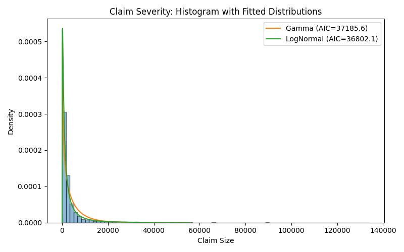

# Insurance Claims Modeling: Frequency & Severity
📌 Overview

This project simulates one year of insurance claims and applies statistical modeling to analyze both:

Frequency: how many claims happen per day

Severity: how large the claims are (in money)

By combining these two models, we can estimate risk exposure and understand the behavior of an insurance portfolio.

## Objectives

Simulate realistic insurance claims (Car, Home, Health)

Model the daily number of claims using a Poisson regression with:

Day of week effects

Lag-1 effect (yesterday’s claims)

Model the claim sizes using Gamma and Lognormal distributions

Evaluate severity models with Q–Q plots and AIC (model fit metric)

Visualize frequency trends and claim size distributions

## How It Works
### Data Simulation

Each day, the number of claims is drawn from a Poisson distribution (average = 5/day).

Each claim size is drawn from an Exponential distribution (average ≈ $2000).

Each claim is randomly assigned to a category: Car, Home, Health.

### Frequency Modeling

Aggregated claims per day.

Added predictors:

Day of week (Mon–Sun)

Yesterday’s claim count (lag1)

Fit a Poisson regression (GLM) to predict daily claims.

### Severity Modeling

Tested both Gamma and Lognormal distributions for claim sizes.

Chose the better model based on AIC.

Evaluated fit visually with a Q–Q plot (observed vs theoretical quantiles).

### Visualization

Observed vs Predicted daily claims (frequency model performance).

Histogram of claim sizes (severity distribution).

Q–Q plot for severity model validation.

## Example Outputs

Observed vs Predicted daily claims (Poisson regression with lag1)

Histogram of all simulated claim amounts

Q–Q Plot

Checking fit of Gamma/Lognormal distribution against observed claims

