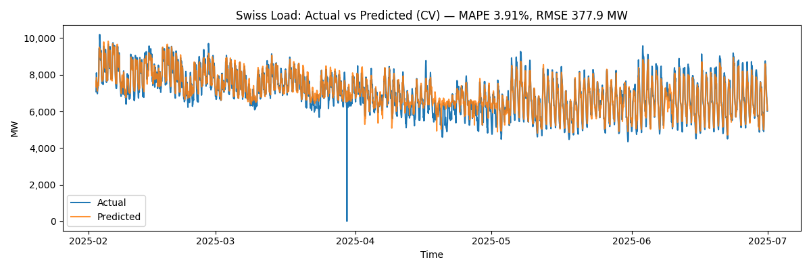
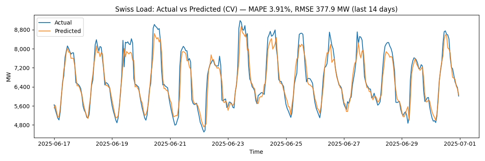

# Swiss Electricity Load Forecasting

**Short-term day-ahead load forecasting model** for the Swiss electricity grid, combining **Swissgrid load data** with **Meteostat weather data**.  
This project demonstrates advanced **time-series forecasting** and **feature engineering** relevant to Swiss energy trading, grid operations, and risk management.

---

## 📌 Project Overview

Swiss electricity demand varies by:
- **Season** (winter heating vs summer cooling)
- **Day of week** (weekdays vs weekends)
- **Weather conditions** (temperature changes)
- **Daily cycles** (morning/evening peaks)

This project builds a machine learning model to predict **hourly load (MW)** one day ahead, using:
- **Historical load data** (Swissgrid)
- **Weather data** (Meteostat API)
- **Calendar features** (hour, weekday, month)
- **Lagged load features** (1h, 24h, 48h, 72h)
- **Rolling averages** (24-hour moving mean)

---

## ⚙️ Tech Stack

- **Python** 3.x
- **Data handling:** `pandas`, `numpy`
- **Visualization:** `matplotlib`
- **Modeling:** `scikit-learn`, `xgboost`
- **Weather API:** `meteostat`
- **Excel parsing:** `openpyxl`

---

## 📊 Results

- **MAPE:** ~3.9% (safe MAPE excluding zero/near-zero load values)
- **RMSE:** ~378 MW (on loads of 5,000–10,000 MW)
- Captures both **seasonal trends** and **daily demand cycles**
- Performs robustly in **winter** and **summer** seasons

---

## 📈 Example Plots

### Actual vs Predicted (Full Period)


### Zoomed View — Last 14 Days


### Winter vs Summer Average Daily Profiles


---


## 🚀 How to Run

1️⃣ Install dependencies:
```bash
pip install pandas numpy matplotlib scikit-learn xgboost meteostat openpyxl
2️⃣ Place the Swissgrid Excel file in:

p1_swiss_load_forecast/data/swissgrid_load.xlsx

3️⃣ Run the main forecast:

python run.py

4️⃣ Run seasonal analysis:

python seasonal_eval.py

📂 Project Structure

p1_swiss_load_forecast/
│
├── run.py                  # Main forecasting script
├── seasonal_eval.py        # Winter vs Summer evaluation
├── data/
│   └── swissgrid_load.xlsx # Input load data
├── out/                    # Generated plots and metrics
└── README.md               # This file
